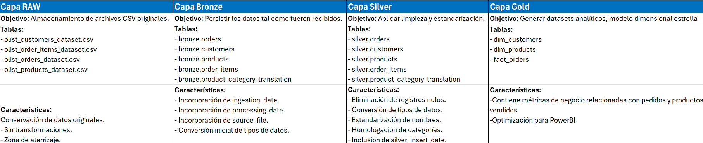
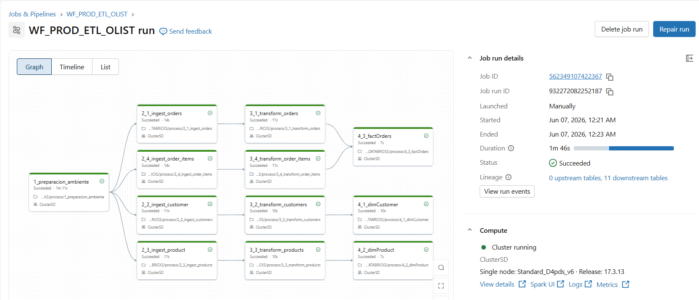

# Proyecto Final Data Engineering - Brazilian E-Commerce Public Dataset by Olist

## 🎯 Descripción

Este proyecto implementa una arquitectura Lakehouse utilizando Azure Data Lake Storage Gen2 y Databricks para procesar información del dataset público de comercio electrónico brasileño Olist.

El objetivo es demostrar conocimientos de Data Engineering mediante la construcción de un pipeline de datos completo utilizando las capas Bronze, Silver y Gold, implementando procesos de ingesta, transformación, gobierno de datos, seguridad y consumo analítico.

## Objetivos

* ETL Automatizado - Aplicar procesos ETL utilizando PySpark con despliegue automático via GitHub Actions
* Arquitectura Medallion - Separación clara de capas Bronze → Silver → Gold
* Realizar ingestión de datos batch y streaming
* Modelo Dimensional - Modelo estrella optimizado para análisis de negocio
* CI/CD Integrado - Deploy automático en cada push a master
* Power BI Dashboards - Visualización
* Unity Catalog - Implementar controles de seguridad utilizando Unity Catalog.

##  Dataset Utilizado

Fuente Principal: Brazilian E-Commerce Public Dataset by Olist

Contiene información histórica de pedidos realizados en la plataforma Olist.

Tablas utilizadas:

- orders
- customers
- products
- order_items

## 🏛️ Arquitectura

Flujo de Datos

#### 📄 CSV (Almacenamiento de archivos CSV originales.)
    ↓
#### 🥉 Bronze Layer (Ingesta de información sin transformación)
    ↓
#### 🥈 Silver Layer (Aplicar limpieza y estandarización)
    ↓
#### 🥇 Gold Layer (Generar datasets analíticos y modelo estrella)
    ↓
#### 📊 BI Dashboards (Visualización)

## Capas del Pipeline

## Tecnologías Utilizadas

- Azure Data Lake Storage Gen2
- Azure Databricks
- PySpark
- Delta Lake
- Unity Catalog
- Databricks Workflows

## Ingesta de Datos

### Batch

Tablas:

- customers
- products
- order_items
- product_category_translation

### Spark Read CSV / Streaming

Tabla:

- orders

### Databricks Auto Loader

Formato:

CSV

Trigger:

availableNow

## Seguridad

Se implementaron permisos mediante Unity Catalog.

### Grupo DataEngineer

Permisos:

- USE CATALOG
- CREATE SCHEMA
- USE SCHEMA
- CREATE TABLE
- MODIFY
- SELECT

Capas:

- Bronze
- Silver
- Gold

### Grupo DataScientist

Permisos:

- USE CATALOG
- USE SCHEMA
- SELECT

Capas:

- Bronze
- Silver
- Gold

### Grupo DataAnalyst

Permisos:

- USE CATALOG
- USE SCHEMA

Acceso únicamente a:

- Gold

Permisos:

- SELECT

##  Orquestación

Se implementó un Workflow en Databricks para automatizar la ejecución de los notebooks.

Orden de ejecución:

1. 1_preparacion_ambiente
2. 2_1_ingest_orders
3. 2_2_ingest_customers
4. 2_3_ingest_products
5. 2_4_ingest_order_items
6. 2_5_ingest_product_category_translation
7. 3_1_transform_orders
8. 3_2_transform_customers
9. 3_3_transform_products
10. 3_4_transform_order_items
11. 4_1_gold_customers
12. 4_2_gold_products
13. 4_3_gold_fact_orders
14. 1_grants

## Calidad de Datos

Validaciones implementadas:

- Verificación de llaves nulas.
- Validación de tipos de datos.
- Estandarización de texto.
- Control de duplicados.
- Trazabilidad mediante fechas de procesamiento.

## Dashboard

Se implemento un dashboard en Power BI para la visualización de la información 

##  Resultados

El proyecto permite:

- Procesar información de comercio electrónico.
- Mantener trazabilidad completa de los datos.
- Proporcionar datasets listos para análisis.
- Garantizar gobierno y seguridad de la información.
- Facilitar el consumo por analistas y científicos de datos.

## Autor

Nombre: Anayeli Flores

Proyecto desarrollado como parte del curso de Data Engineering utilizando Azure Databricks y Delta Lake.
